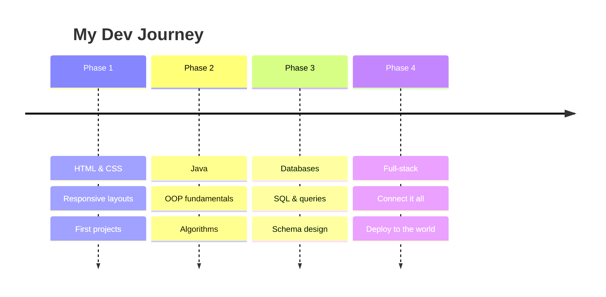

<div align="center">


<br><br>


&nbsp;


</div>

---

## About Me

### I'm a developer in the making

> "The only way to learn a new programming language is by writing programs in it." — Dennis Ritchie

| | |
|--|-|
| **What I do** | Craft layouts with **HTML & CSS** and bring designs to the browser |
| **Learning** | **Java** — OOP, data structures, and everything in between |
| **Exploring** | **Databases** — writing queries, designing schemas, understanding data |
| **Goal** | Become a **full-stack developer** who can build end-to-end |
| **Vibe** | Curious mind, consistent effort, shipping code regularly |

---

## Tech Arsenal

<div align="center">

| HTML5 | CSS3 | Java _(learning)_ | Banco de Dados _(learning)_ |
|:-:|:-:|:-:|:-:|
|  |  |  |  |
| &#9733;&#9733;&#9733;&#9733;&#9734; | &#9733;&#9733;&#9733;&#9733;&#9734; | &#9733;&#9733;&#9734;&#9734;&#9734; | &#9733;&#9733;&#9734;&#9734;&#9734; |

</div>

### Skill Breakdown

<div align="center">

```
HTML5       ████████████████████░░░░░░  70 %
CSS3        ██████████████████░░░░░░░░  65 %
Java        ██████████░░░░░░░░░░░░░░░░  35 %
Banco de Dados ████████░░░░░░░░░░░░░░░░░░  30 %
```

</div>

---

## Learning Roadmap

<div align="center">



</div>

---

## GitHub Dashboard

<div align="center">


</div>

<div align="center">


</div>

<div align="center">


</div>

---

## Let's Connect

<p align="center">
  <a href="https://www.linkedin.com/in/SEU_LINKEDIN" target="_blank">
    
  </a>
  &nbsp;
  <a href="mailto:guibentes@hotmail.com">
    
  </a>
</p>

<p align="center">
  <a href="mailto:guibentes@hotmail.com">
  
</p>

---


