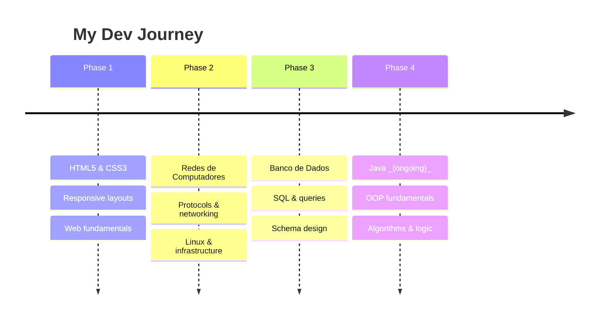

<div align="center">
  
</div>

<div align="center">


<br><br>


&nbsp;

&nbsp;


</div>

---

## About Me

### Guilherme Bentes Teixeira Xavier

> "The only way to learn a new programming language is by writing programs in it." — Dennis Ritchie

| | |
|--|-|
| **Who I am** | 22-year-old developer starting my career in tech |
| **First language** | **Java** — still learning, but hungry for knowledge |
| **What I know** | **Redes de Computadores**, **Banco de Dados**, **HTML5**, **CSS3** |
| **Mindset** | Always studying, always improving |
| **Vibe** | Curious mind, consistent effort, shipping code |

---

## Tech Arsenal

<div align="center">

| HTML5 | CSS3 | Java _(learning)_ | Redes _(intermediate)_ | Banco de Dados _(learning)_ |
|:-:|:-:|:-:|:-:|:-:|
|  |  |  |  |  |

</div>

### Skill Breakdown

<div align="center">

```
Redes de Computadores  ████████████████████░░░░░░  70 %
HTML5                  ██████████████████░░░░░░░░  65 %
CSS3                   ██████████████████░░░░░░░░  65 %
Banco de Dados         ████████████████░░░░░░░░░░  60 %
Java                   ████████░░░░░░░░░░░░░░░░░░  20 %
```

</div>

---

## Learning Roadmap

<div align="center">



</div>
