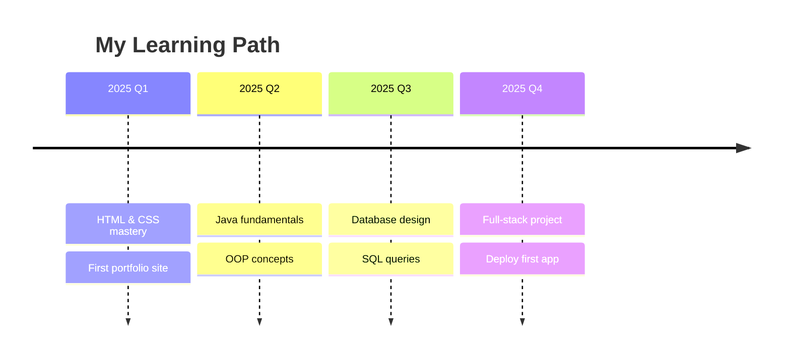

<div align="center">

# Hey there, I'm [Your Name]


</div>

<div align="center">


<br>


</div>

> "Code is like humor. When you have to explain it, it's bad." — Cory House

---

##  About Me

<div align="center">
  
</div>

<br>

| | Details |
|-|---------|
| **Location** | Brazil |
| **Focus** | Frontend + Java + Databases |
| **Currently** | Building projects to learn |
| **Dream** | Become a full-stack dev |

<br clear="right"/>

---

##  Arsenal

<div align="center">

### Tools & Technologies

| | |
|:-:|:-:|
| **Comfortable** |   |
| **Learning** |  |
| **Exploring** |  |

</div>

### Skill Level

<div align="center">

```
HTML5     ████████████████████░░░░░░  70%
CSS3      ██████████████████░░░░░░░░  65%
Java      ██████████░░░░░░░░░░░░░░░░  35%
MySQL     █████████░░░░░░░░░░░░░░░░░  30%
Git       ████████░░░░░░░░░░░░░░░░░░  25%
```

</div>

---

##  Roadmap 2025

<div align="center">



</div>

---

##  GitHub Dashboard

<div align="center">


</div>

<div align="center">


</div>

<div align="center">


</div>

---

##  Find Me Around The Web

<div align="center">

<a href="https://www.linkedin.com/in/SEU_LINKEDIN" target="_blank">
  
</a>
&nbsp;&nbsp;
<a href="mailto:SEU_EMAIL@gmail.com">
  
</a>

<br><br>


</div>

---

<div align="center">

_Made with curiosity and caffeine_


</div>
